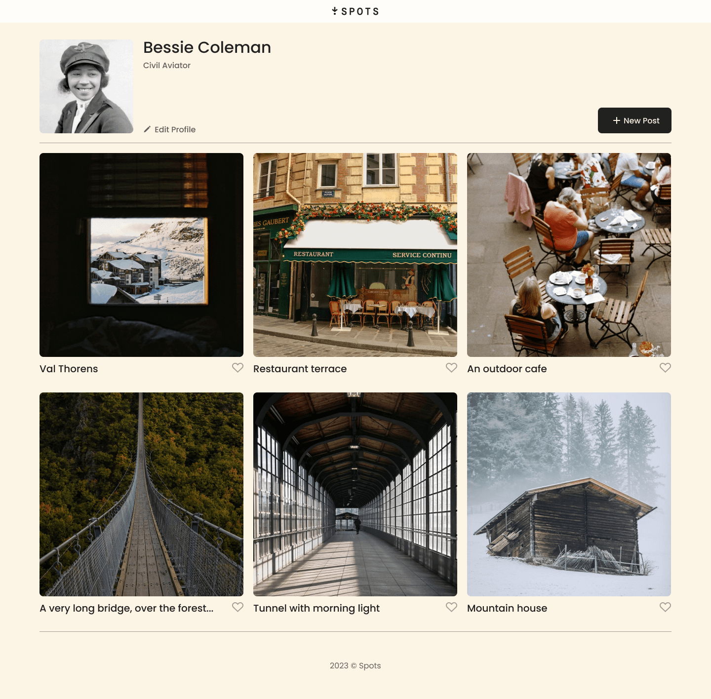
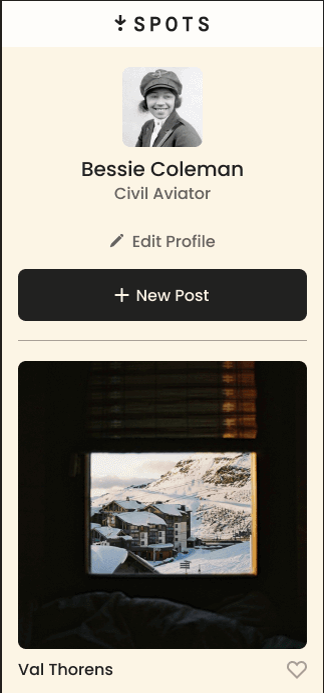

# Project 3: Spots
An image sharing site.

## Description
This project involved designing an image sharing website, featuring image posts that can be inteacted with a "like" and displayed in a grid format that adapts to screen sizes for desktop, tablet, and mobile.

## Technologies Used
* Figma
* VS Code
* GitHub

### Overview  

* Intro  
* Figma  
* Images  
  
**Intro**
  
This project is designed so that all the elements are displayed correctly on popular screen sizes. The UI is responsive for desktop, tablet, and moblie formats to accomodate the different screen sizes.

The layout of the screens will shift from a grid to column format to better suit smaller screens.

**Figma**  
  
* Figma project link: https://www.figma.com/file/BBNm2bC3lj8QQMHlnqRsga/Sprint-3-Project-%E2%80%94-Spots?type=design&node-id=2%3A60&mode=design&t=afgNFybdorZO6cQo-1
  
**Images**  
 Screens coded for this project:

  

**Tech Stack**
-HTML
-CSS
-Responsive Design

Site/Deployment Link:
https://bgomes29.github.io/se_project_spots/

Video walkthrough of Sprint 3 project
https://drive.google.com/file/d/1j5mNjr3RRblAYUBDPHXQeD1JluK5c46m/view?usp=sharing